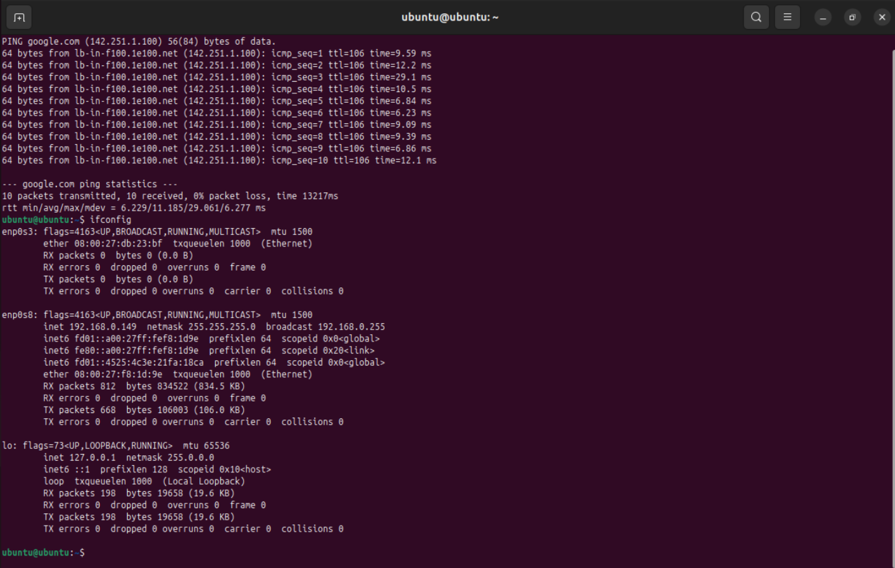
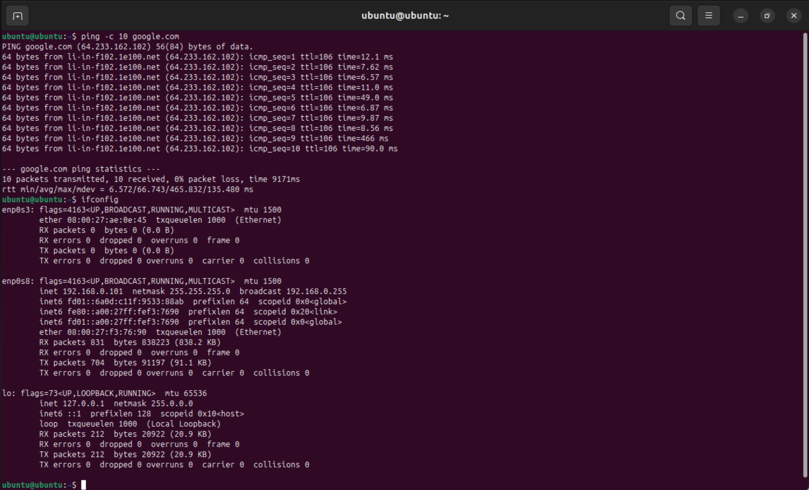
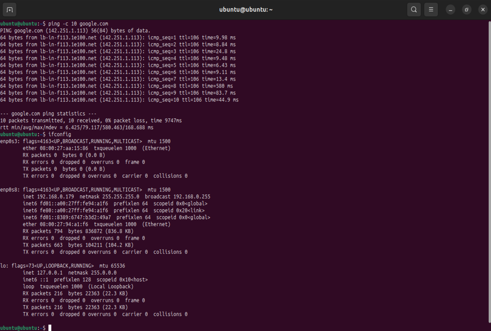
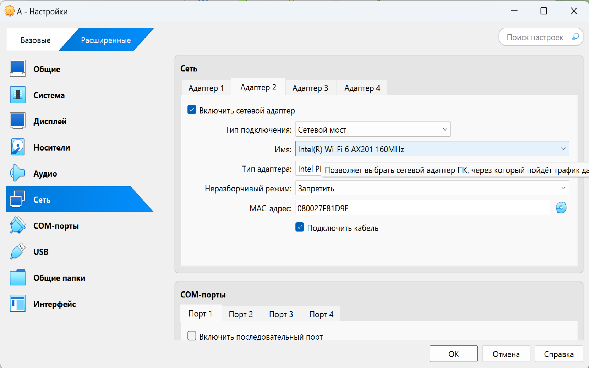
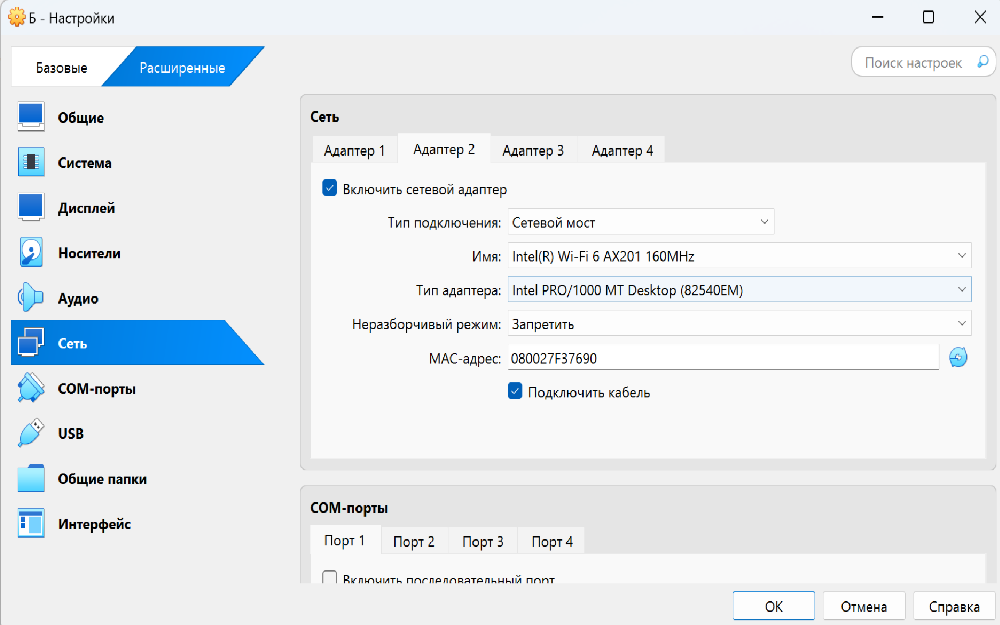
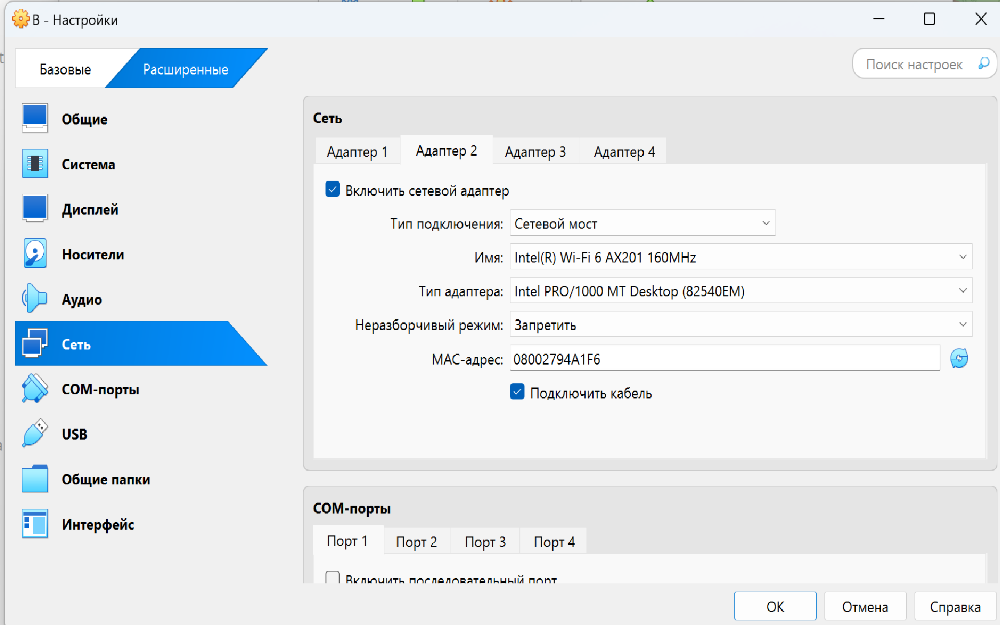
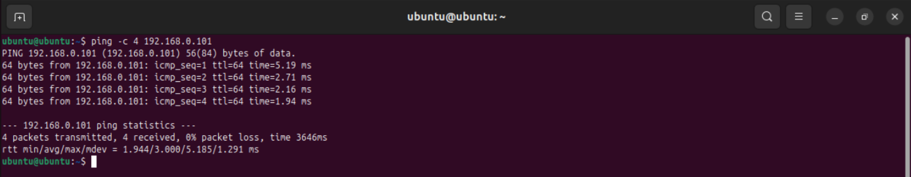
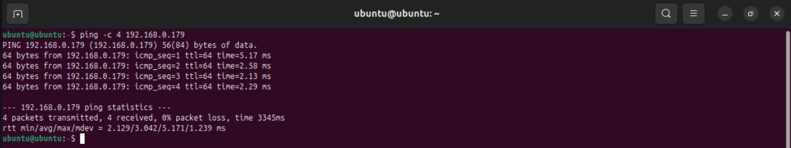
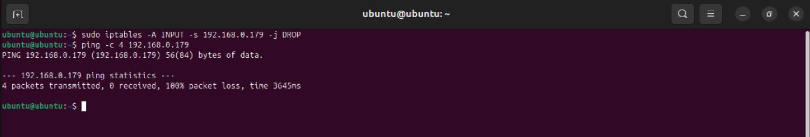

# Лабораторная работа 3
## 1. Устанавливаю VirtualBox, создаю и настраиваю виртуальную машину А с Ubuntu:

- Проверяем доступ виртуальной машины А к интернету с помощью команды `ping -c 10 google.com`
  
Каким образом работает команда:

Утилита `ping` отправляет запросы на указанный адрес для проверки его доступности.
Флаг `-с 10` указывает количество пакетов, отправляемых на адрес ( в данном случае это 10 запросов )
Адрес, на который будет отправляться запрос указывается в самом конце `google.com`
В нашей проверке все 10 пакетов получены, значит доступ в интернет осуществлён успешно.

-  Узнаем IP виртуальной машины А для дальнейшей работы, написав в терминале виртуальной машины команду `ifconfig`:

## 2. Создаём и настраиваем виртуальную машину Б на Ubuntu и проверяем её доступ к интернету:

- Узнаем IP виртуальной машины Б для дальнейшей работы:

## 3. Создаём и настраиваем виртуальную машину В на Ubuntu и проверяем её доступ к интернету:
   
- Узнаем IP виртуальной машины В для дальнейшей работы

Отметим:
1) IP машины А - 192.168.0.149
2) IP машины Б - 192.168.0.101
3) IP машины В - 192.168.0.179

## 4. Настраиваем сеть для всех машин:

Для этого мы проверили, что все машины подключены к интернет сети,следовательно выбираем в "Адаптере 2" для каждой машины тип подлючения `Сетевой мост`

На данном этапе сетевой доступ по умолчанию разрешён как из `А в Б`, так и из `А в В`.

## 5. Организуем сетевой доступ из машины А в машину Б:
С помощью утилиты `ping` и указания IP машины, которую виртуальная машина А должна пинговать, проверим, что передаются все пакеты и настроен сетевой доступ

## 6. Организуем сетевой доступ из машины А в машину В:

Все пакеты успешно пингуются, значит сетевой доступ обеспечен.

## 7. Запретим сетевой доступ из машины Б в машину В:
С помощью команды `sudo iptables -A INPUT -s 192.168.0.ip -j DROP`, которую нужно ввести в терминале виртуальной машины B, запрещаем доступ из Б в В.
Далее при помощи `ping` проверяем, что машина Б не пингует машину В.

Эта команда работает следующим образом:
- `iptables` - утилита для настройки правил фильтрации сетевых пакетов в Линукс. С её помощью мы можем устанавливать контроль доступа к сетевым интерфейсам
- A — флаг, означающий "append", т.е. добавление нового правила в указанную цепочку. Цепочки могут быть INPUT, OUTPUT и FORWARD.
- INPUT — это цепочка в iptables, которая обрабатывает входящие пакеты (пакеты, приходящие на машину).
- -s — флаг, указывающий источник пакета. Он позволяет задать IP-адрес или подсеть, откуда пришел пакет.
192.168.0.101 — это конкретный IP-адрес источника, для которого установлено правило. В данном случае, оно применяется к пакетам, приходящим с этого IP.
- -j — флаг, указывающий на то, что будет сделано с пакетом, соответствующим правилам.
- DROP — действие, которое будет выполнено в отношении пакетов, соответствующих правилам. В данном случае, DROP означает, что пакеты будут отброшены, т.е. никакие пакеты от источника не будут приняты.

## 8. Вывод

- Успешно организован сетевой доступ из А в Б
- Успешно организован сетевой доступ из А в В
- Запрещён доступ из Б в В

Что вам нужно знать, чтобы успешно защитить работу:
Топологии сетей; модель OSI; NAT + зачем нужно, типы; DNS; DHCP + как хосты получают адреса; таблица маршрутизации.
