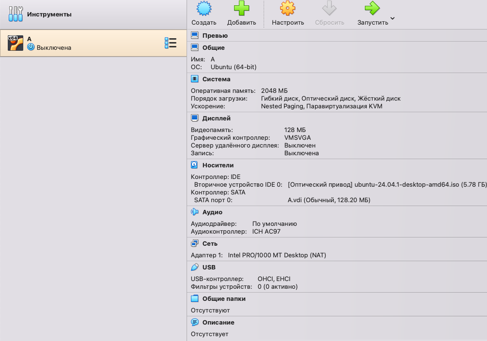
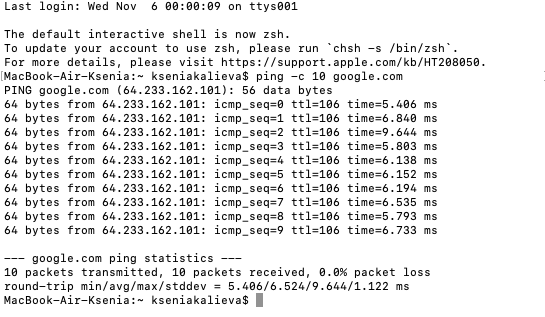
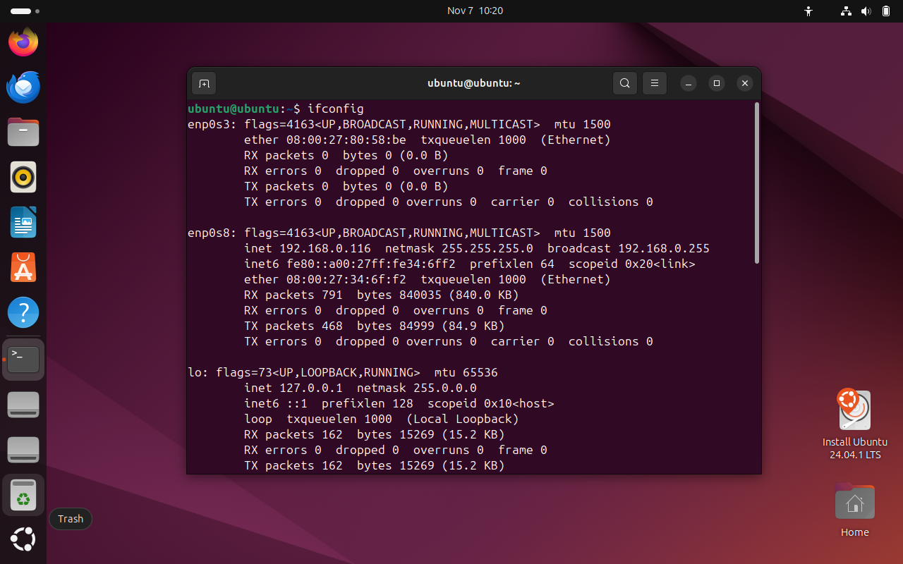
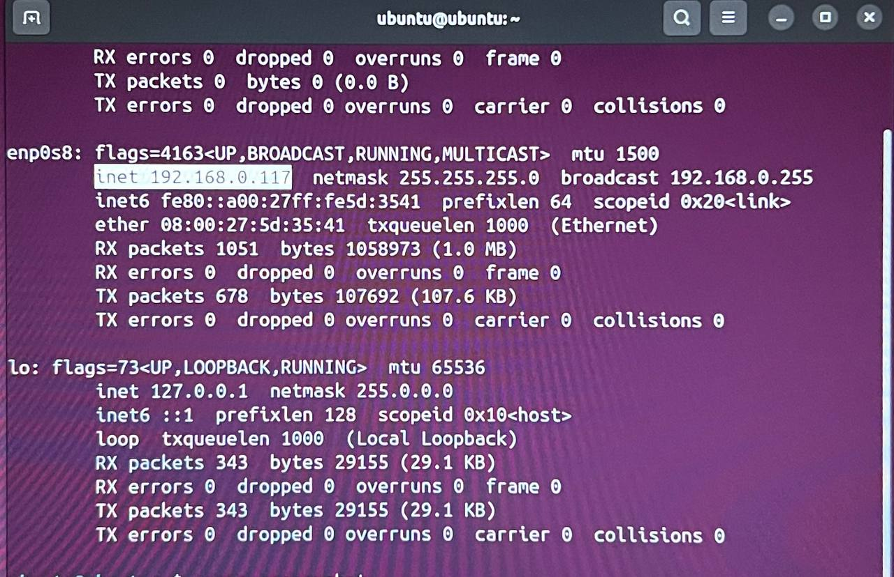
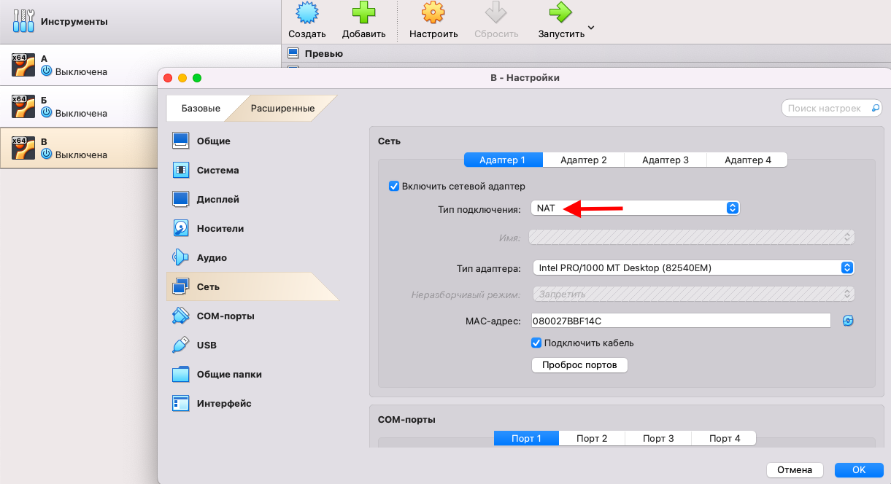
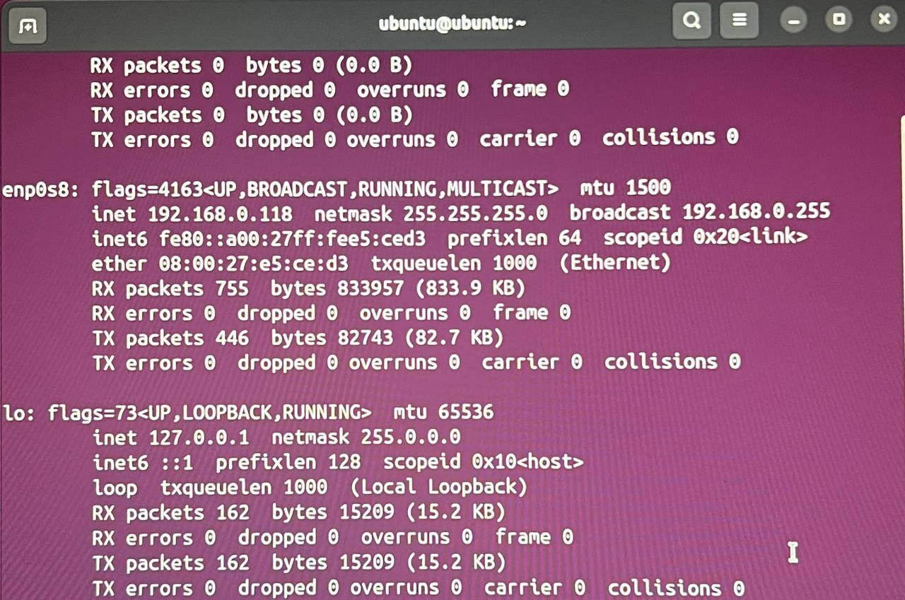
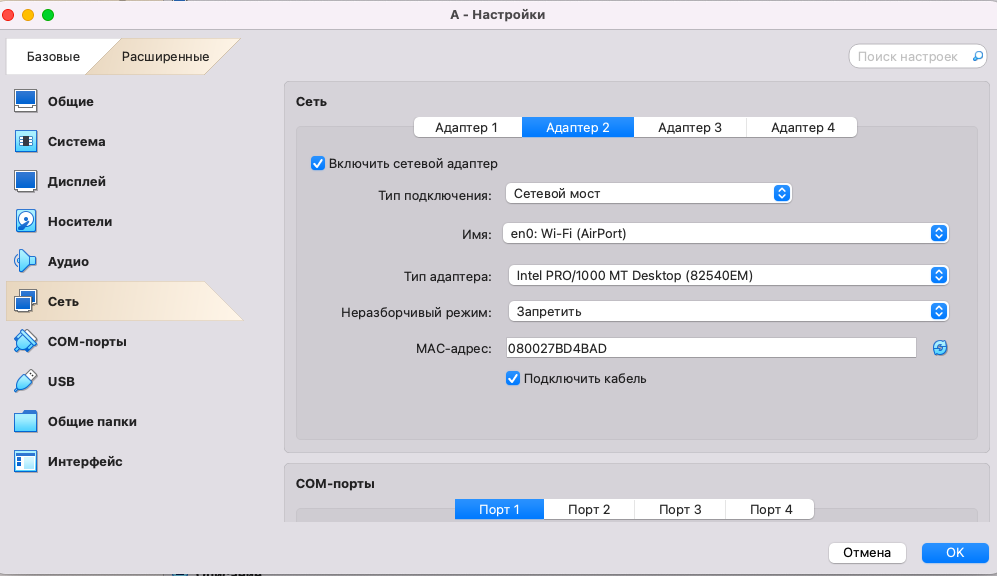
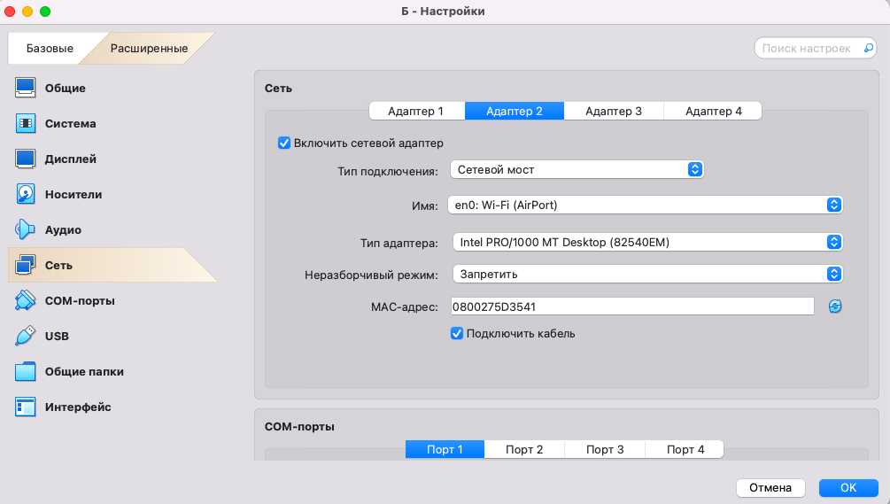

# Лабораторная работа 3
## 1. Устанавливаю VirtualBox, создаю и настраиваю виртуальную машину А с Ubuntu:
   

- Проверяем доступ виртуальной машины А к интернету:

Каким образом?
Утилита `ping` отправляет запросы на указанный адрес для проверки его доступности.
Флаг `-с 10` указывает количество пакетов, отправляемых на адрес ( в данном случае это 10 запросов )
Адрес, на который будет отправляться запрос указывается в самом конце `google.com`
В нашей проверке все 10 пакетов получены, значит доступ в интернет осуществлён успешно.

- Узнаем IP виртуальной машины А для дальнейшей работы, написав в терминале виртуальной машины команду `ifconfig`:

## 2. Создаём и настраиваем виртуальную машину Б на Ubuntu и проверяем её доступ к интернету:

- Узнаем IP виртуальной машины Б для дальнейшей работы:

## 3. Создаём и настраиваем виртуальную машину В на Ubuntu и проверяем её доступ к интернету:

   
- Узнаем IP виртуальной машины В для дальнейшей работы

Отметим:
IP машины А - 192.168.0.116
IP машины Б - 192.168.0.117
IP машины В - 192.168.0.118

## 4. Настраиваем сеть для всех машин:

Для этого мы проверили, что все машины подключены к интернет сети,следовательно выбираем в "Адаптере 2" для каждой машины тип подлючения `Сетевой мост`

На данном этапе сетевой доступ по умолчанию разрешён как из `А в Б`, так и из `А в В`.

## 5. Организуем сетевой доступ из машины А в машину Б:
С помощью утилиты `ping` и указания IP машины, которую виртуальная машина А должна пинговать, проверим, что передаются все пакеты и настроен сетевой доступ

## 6. Организуем сетевой доступ из машины А в машину В:

## 7. Запретим сетевой доступ из машины Б в машину В:

## 8. Проверим сетевой доступ для всех трёх машин:

Что вам нужно знать, чтобы успешно защитить работу:

Топологии сетей; модель OSI; NAT + зачем нужно, типы; DNS; DHCP + как хосты получают адреса; таблица маршрутизации.

## Источники

Лекции 4-5.

[Источник где можно найти все](https://google.com)
