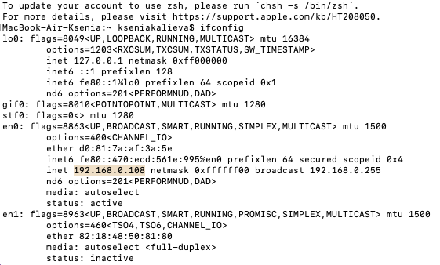

# Лабораторная работа 3
1. Устанавливаю VirtualBox, создаю и настраиваю виртуальную машину А с Ubuntu:
   

- Проверяем доступ виртуальной машины А к интернету:

Каким образом?
Утилита `ping` отправляет запросы на указанный адрес для проверки его доступности.
Флаг `-с 10` указывает количество пакетов, отправляемых на адрес ( в данном случае это 10 запросов )
Адрес, на который будет отправляться запрос указывается в самом конце `google.com`
В нашей проверке все 10 пакетов получены, значит доступ в интернет осуществлён успешно.

- Узнаем IP виртуальной машины А для дальнейшей работы:

3. Создаём и настраиваем виртуальную машину Б на Ubuntu и проверяем её доступ к интернету:

- Узнаем IP виртуальной машины Б для дальнейшей работы:

4. Создаём и настраиваем виртуальную машину В на Ubuntu и проверяем её доступ к интернету:
   
- Узнаем IP виртуальной машины В для дальнейшей работы:

5. Отметим:
IP машины А - 192.168.0.108
IP машины Б - 
IP машины В -

6. Организуем сетевой доступ из машины А в машину Б:

7. Организуем сетевой доступ из машины А в машину В:

8. Запретим сетевой доступ из машины Б в машину В:

9. Проверим сетевой доступ для всех трёх машин:

## Задание

Что вам нужно знать, чтобы успешно защитить работу:

Топологии сетей; модель OSI; NAT + зачем нужно, типы; DNS; DHCP + как хосты получают адреса; таблица маршрутизации.

## Источники

Лекции 4-5.

[Источник где можно найти все](https://google.com)
